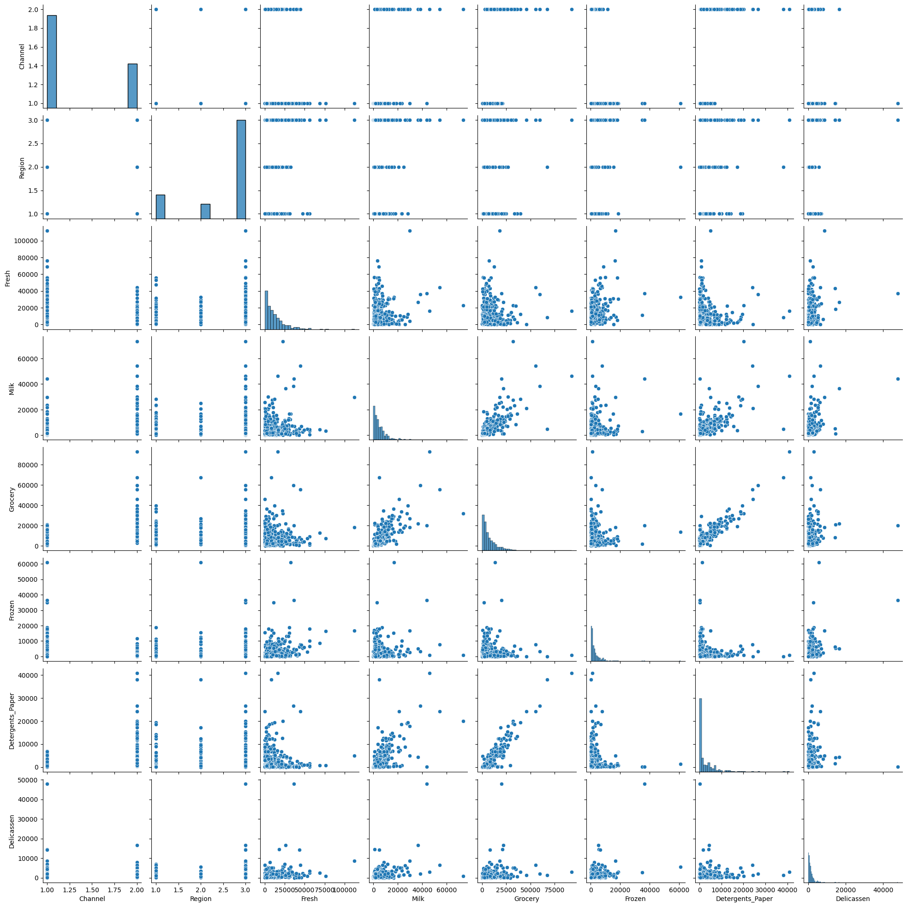
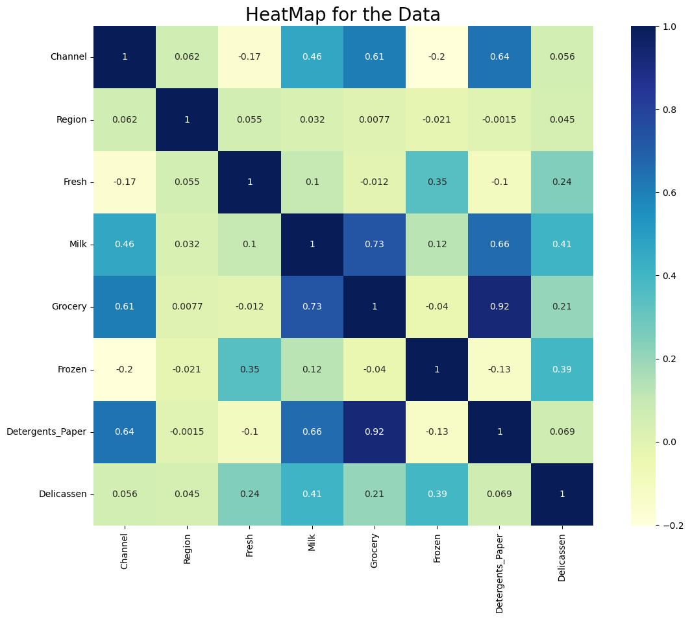
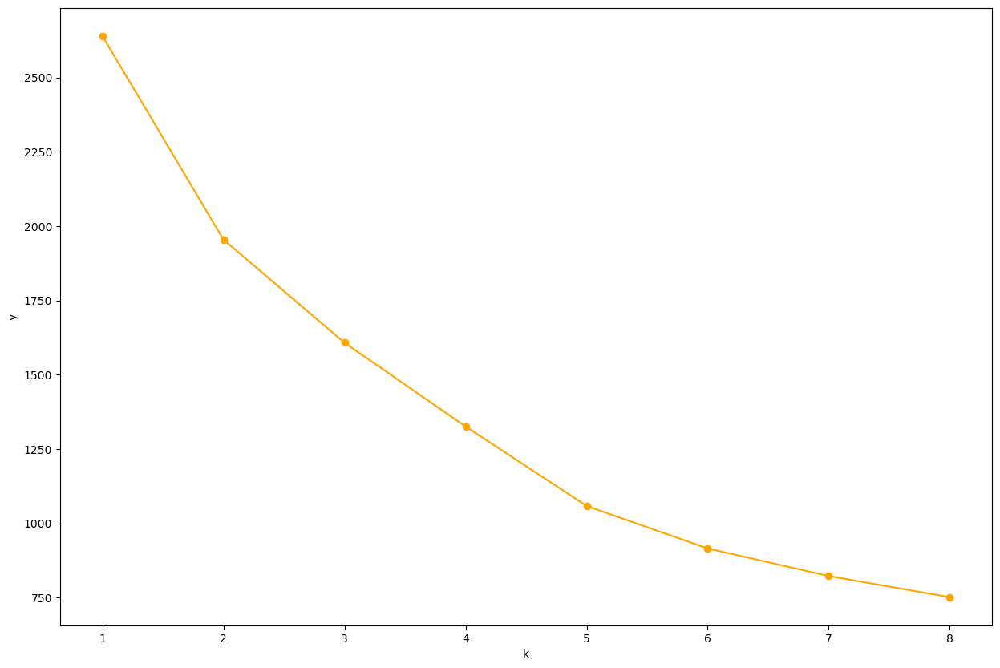
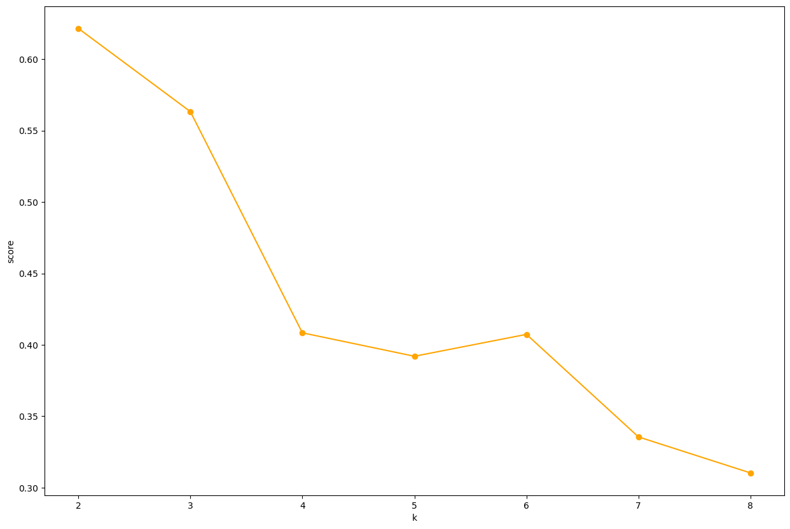

```python
#导入数据可视化库，科学计算库，结构化数据处理库
import matplotlib.pyplot as plt
import seaborn as sns
import numpy as np
import pandas as pd
from sklearn.preprocessing import StandardScaler
from sklearn.metrics import silhouette_score
from sklearn import preprocessing

#忽略警告信息
import warnings
warnings.filterwarnings("ignore")

data= pd.read_csv('data.csv')

```


```python
#统计描述：均值标准差最大值
print(data.describe())
```

              Channel      Region          Fresh          Milk       Grocery  \
    count  440.000000  440.000000     440.000000    440.000000    440.000000   
    mean     1.322727    2.543182   12000.297727   5796.265909   7951.277273   
    std      0.468052    0.774272   12647.328865   7380.377175   9503.162829   
    min      1.000000    1.000000       3.000000     55.000000      3.000000   
    25%      1.000000    2.000000    3127.750000   1533.000000   2153.000000   
    50%      1.000000    3.000000    8504.000000   3627.000000   4755.500000   
    75%      2.000000    3.000000   16933.750000   7190.250000  10655.750000   
    max      2.000000    3.000000  112151.000000  73498.000000  92780.000000   
    
                 Frozen  Detergents_Paper    Delicassen  
    count    440.000000        440.000000    440.000000  
    mean    3071.931818       2881.493182   1524.870455  
    std     4854.673333       4767.854448   2820.105937  
    min       25.000000          3.000000      3.000000  
    25%      742.250000        256.750000    408.250000  
    50%     1526.000000        816.500000    965.500000  
    75%     3554.250000       3922.000000   1820.250000  
    max    60869.000000      40827.000000  47943.000000  
    


```python
data.head(5)
```


<div>
<style scoped>
    .dataframe tbody tr th:only-of-type {
        vertical-align: middle;
    }

    .dataframe tbody tr th {
        vertical-align: top;
    }

    .dataframe thead th {
        text-align: right;
    }
</style>
<table border="1" class="dataframe">
  <thead>
    <tr style="text-align: right;">
      <th></th>
      <th>Channel</th>
      <th>Region</th>
      <th>Fresh</th>
      <th>Milk</th>
      <th>Grocery</th>
      <th>Frozen</th>
      <th>Detergents_Paper</th>
      <th>Delicassen</th>
    </tr>
  </thead>
  <tbody>
    <tr>
      <th>0</th>
      <td>2</td>
      <td>3</td>
      <td>12669</td>
      <td>9656</td>
      <td>7561</td>
      <td>214</td>
      <td>2674</td>
      <td>1338</td>
    </tr>
    <tr>
      <th>1</th>
      <td>2</td>
      <td>3</td>
      <td>7057</td>
      <td>9810</td>
      <td>9568</td>
      <td>1762</td>
      <td>3293</td>
      <td>1776</td>
    </tr>
    <tr>
      <th>2</th>
      <td>2</td>
      <td>3</td>
      <td>6353</td>
      <td>8808</td>
      <td>7684</td>
      <td>2405</td>
      <td>3516</td>
      <td>7844</td>
    </tr>
    <tr>
      <th>3</th>
      <td>1</td>
      <td>3</td>
      <td>13265</td>
      <td>1196</td>
      <td>4221</td>
      <td>6404</td>
      <td>507</td>
      <td>1788</td>
    </tr>
    <tr>
      <th>4</th>
      <td>2</td>
      <td>3</td>
      <td>22615</td>
      <td>5410</td>
      <td>7198</td>
      <td>3915</td>
      <td>1777</td>
      <td>5185</td>
    </tr>
  </tbody>
</table>
</div>


```python
#检测缺失值

data.isnull().any().any()
```


    False


```python
#打印基本信息

print(data.info())
```

    <class 'pandas.core.frame.DataFrame'>
    RangeIndex: 440 entries, 0 to 439
    Data columns (total 8 columns):
     #   Column            Non-Null Count  Dtype
    ---  ------            --------------  -----
     0   Channel           440 non-null    int64
     1   Region            440 non-null    int64
     2   Fresh             440 non-null    int64
     3   Milk              440 non-null    int64
     4   Grocery           440 non-null    int64
     5   Frozen            440 non-null    int64
     6   Detergents_Paper  440 non-null    int64
     7   Delicassen        440 non-null    int64
    dtypes: int64(8)
    memory usage: 27.6 KB
    None
    


```python
#散点图 展示多个变量的关系
sns.pairplot(data)
plt.show()
```


    

    


```python

```


```python
#生成热力图展示变量之间的相关性
sns.heatmap(data.corr(),square=True,cmap='YlGnBu',annot=True)
plt.title("HeatMap for the Data",fontsize=20)
plt.show()
```


    

    


```python
#获取channel和region以外的数据，并转化为数组
X = data.iloc[:,[2,3,4,5,6,7]].values

print(type(X))
print(X.shape)
```

    <class 'numpy.ndarray'>
    (440, 6)
    


```python
# 标准化
scaler = StandardScaler()
scaled_data = scaler.fit_transform(X)
print(scaled_data)

```

    [[ 0.05293319  0.52356777 -0.04111489 -0.58936716 -0.04356873 -0.06633906]
     [-0.39130197  0.54445767  0.17031835 -0.27013618  0.08640684  0.08915105]
     [-0.44702926  0.40853771 -0.0281571  -0.13753572  0.13323164  2.24329255]
     ...
     [ 0.20032554  1.31467078  2.34838631 -0.54337975  2.51121768  0.12145607]
     [-0.13538389 -0.51753572 -0.60251388 -0.41944059 -0.56977032  0.21304614]
     [-0.72930698 -0.5559243  -0.57322717 -0.62009417 -0.50488752 -0.52286938]]
    


```python
#归一化
min_max_scaler = preprocessing.MinMaxScaler()
Kmeansdata_minmax = min_max_scaler.fit_transform(X)
print(Kmeansdata_minmax)
```

    [[0.11294004 0.13072723 0.08146416 0.0031063  0.0654272  0.02784731]
     [0.06289903 0.13282409 0.10309667 0.02854842 0.08058985 0.03698373]
     [0.05662161 0.11918086 0.08278992 0.03911643 0.08605232 0.16355861]
     ...
     [0.1295431  0.21013575 0.32594285 0.00677142 0.36346267 0.03888194]
     [0.091727   0.02622442 0.02402535 0.01664914 0.00404174 0.04426366]
     [0.02482434 0.02237109 0.02702178 0.00065742 0.01161082 0.00102211]]
    


```python
#手肘法
SSE = []
for k in range(1,9):
    clf=KMeans(n_clusters=k,random_state=42)
    clf.fit(scaled_data)
    SSE.append(clf.inertia_)

plt.xlabel('k')
plt.ylabel('y')
plt.plot(range(1,9),SSE,'o-',color='orange')
plt.show()
```


    

    


```python
#轮廓系数法
Scores = []
for k in range(2,9):
    clf=KMeans(n_clusters=k,random_state=42)
    clf.fit(scaled_data)
    Scores.append(silhouette_score(Kmeansdata_minmax,clf.labels_,metric='euclidean'))
    
plt.xlabel('k')
plt.ylabel('score')
plt.plot(range(2,9),Scores,'o-',color='orange')
plt.show()
```


    

    


```python
#Kmeans聚类算法
#最优k = 4
clf=KMeans(n_clusters=4,random_state=42)
clf.fit(Kmeansdata_minmax)
Labels=clf.labels_
x['labels'] = Labels
x.head(20)
```


<div>
<style scoped>
    .dataframe tbody tr th:only-of-type {
        vertical-align: middle;
    }

    .dataframe tbody tr th {
        vertical-align: top;
    }

    .dataframe thead th {
        text-align: right;
    }
</style>
<table border="1" class="dataframe">
  <thead>
    <tr style="text-align: right;">
      <th></th>
      <th>Fresh</th>
      <th>Milk</th>
      <th>Grocery</th>
      <th>Frozen</th>
      <th>Detergents_Paper</th>
      <th>Delicassen</th>
      <th>labels</th>
    </tr>
  </thead>
  <tbody>
    <tr>
      <th>0</th>
      <td>12669</td>
      <td>9656</td>
      <td>7561</td>
      <td>214</td>
      <td>2674</td>
      <td>1338</td>
      <td>3</td>
    </tr>
    <tr>
      <th>1</th>
      <td>7057</td>
      <td>9810</td>
      <td>9568</td>
      <td>1762</td>
      <td>3293</td>
      <td>1776</td>
      <td>3</td>
    </tr>
    <tr>
      <th>2</th>
      <td>6353</td>
      <td>8808</td>
      <td>7684</td>
      <td>2405</td>
      <td>3516</td>
      <td>7844</td>
      <td>3</td>
    </tr>
    <tr>
      <th>3</th>
      <td>13265</td>
      <td>1196</td>
      <td>4221</td>
      <td>6404</td>
      <td>507</td>
      <td>1788</td>
      <td>3</td>
    </tr>
    <tr>
      <th>4</th>
      <td>22615</td>
      <td>5410</td>
      <td>7198</td>
      <td>3915</td>
      <td>1777</td>
      <td>5185</td>
      <td>3</td>
    </tr>
    <tr>
      <th>5</th>
      <td>9413</td>
      <td>8259</td>
      <td>5126</td>
      <td>666</td>
      <td>1795</td>
      <td>1451</td>
      <td>3</td>
    </tr>
    <tr>
      <th>6</th>
      <td>12126</td>
      <td>3199</td>
      <td>6975</td>
      <td>480</td>
      <td>3140</td>
      <td>545</td>
      <td>3</td>
    </tr>
    <tr>
      <th>7</th>
      <td>7579</td>
      <td>4956</td>
      <td>9426</td>
      <td>1669</td>
      <td>3321</td>
      <td>2566</td>
      <td>3</td>
    </tr>
    <tr>
      <th>8</th>
      <td>5963</td>
      <td>3648</td>
      <td>6192</td>
      <td>425</td>
      <td>1716</td>
      <td>750</td>
      <td>3</td>
    </tr>
    <tr>
      <th>9</th>
      <td>6006</td>
      <td>11093</td>
      <td>18881</td>
      <td>1159</td>
      <td>7425</td>
      <td>2098</td>
      <td>0</td>
    </tr>
    <tr>
      <th>10</th>
      <td>3366</td>
      <td>5403</td>
      <td>12974</td>
      <td>4400</td>
      <td>5977</td>
      <td>1744</td>
      <td>0</td>
    </tr>
    <tr>
      <th>11</th>
      <td>13146</td>
      <td>1124</td>
      <td>4523</td>
      <td>1420</td>
      <td>549</td>
      <td>497</td>
      <td>3</td>
    </tr>
    <tr>
      <th>12</th>
      <td>31714</td>
      <td>12319</td>
      <td>11757</td>
      <td>287</td>
      <td>3881</td>
      <td>2931</td>
      <td>1</td>
    </tr>
    <tr>
      <th>13</th>
      <td>21217</td>
      <td>6208</td>
      <td>14982</td>
      <td>3095</td>
      <td>6707</td>
      <td>602</td>
      <td>0</td>
    </tr>
    <tr>
      <th>14</th>
      <td>24653</td>
      <td>9465</td>
      <td>12091</td>
      <td>294</td>
      <td>5058</td>
      <td>2168</td>
      <td>0</td>
    </tr>
    <tr>
      <th>15</th>
      <td>10253</td>
      <td>1114</td>
      <td>3821</td>
      <td>397</td>
      <td>964</td>
      <td>412</td>
      <td>3</td>
    </tr>
    <tr>
      <th>16</th>
      <td>1020</td>
      <td>8816</td>
      <td>12121</td>
      <td>134</td>
      <td>4508</td>
      <td>1080</td>
      <td>0</td>
    </tr>
    <tr>
      <th>17</th>
      <td>5876</td>
      <td>6157</td>
      <td>2933</td>
      <td>839</td>
      <td>370</td>
      <td>4478</td>
      <td>3</td>
    </tr>
    <tr>
      <th>18</th>
      <td>18601</td>
      <td>6327</td>
      <td>10099</td>
      <td>2205</td>
      <td>2767</td>
      <td>3181</td>
      <td>3</td>
    </tr>
    <tr>
      <th>19</th>
      <td>7780</td>
      <td>2495</td>
      <td>9464</td>
      <td>669</td>
      <td>2518</td>
      <td>501</td>
      <td>3</td>
    </tr>
  </tbody>
</table>
</div>


```python
centers = x.groupby('labels').mean()
centers
```


<div>
<style scoped>
    .dataframe tbody tr th:only-of-type {
        vertical-align: middle;
    }

    .dataframe tbody tr th {
        vertical-align: top;
    }

    .dataframe thead th {
        text-align: right;
    }
</style>
<table border="1" class="dataframe">
  <thead>
    <tr style="text-align: right;">
      <th></th>
      <th>Fresh</th>
      <th>Milk</th>
      <th>Grocery</th>
      <th>Frozen</th>
      <th>Detergents_Paper</th>
      <th>Delicassen</th>
    </tr>
    <tr>
      <th>labels</th>
      <th></th>
      <th></th>
      <th></th>
      <th></th>
      <th></th>
      <th></th>
    </tr>
  </thead>
  <tbody>
    <tr>
      <th>0</th>
      <td>5813.978495</td>
      <td>10753.709677</td>
      <td>17016.204301</td>
      <td>1461.215054</td>
      <td>7356.451613</td>
      <td>1867.763441</td>
    </tr>
    <tr>
      <th>1</th>
      <td>38101.632653</td>
      <td>6329.489796</td>
      <td>6422.448980</td>
      <td>8519.632653</td>
      <td>971.857143</td>
      <td>3317.346939</td>
    </tr>
    <tr>
      <th>2</th>
      <td>15964.900000</td>
      <td>34708.500000</td>
      <td>48536.900000</td>
      <td>3054.600000</td>
      <td>24875.200000</td>
      <td>2942.800000</td>
    </tr>
    <tr>
      <th>3</th>
      <td>9419.451389</td>
      <td>3100.805556</td>
      <td>3874.951389</td>
      <td>2665.795139</td>
      <td>997.687500</td>
      <td>1059.940972</td>
    </tr>
  </tbody>
</table>
</div>


```python
x['labels'].value_counts()
```


    3    288
    0     93
    1     49
    2     10
    Name: labels, dtype: int64


```python
#DBSCAN聚类（eps和min_samples随便找的）
from sklearn.cluster import DBSCAN
dbscan = DBSCAN(eps=0.05, min_samples=5)
dbscan.fit(X)
```


    DBSCAN(eps=0.05)


```python
#查看标签
dbscan.labels_[:10]
```


    array([ 0,  2, -1, -1,  1,  0,  0,  0,  2,  5], dtype=int64)


```python
#核心样本索引
dbscan.core_sample_indices_[:10]
```


    array([ 0,  4,  5,  6,  7,  8, 10, 11, 12, 13], dtype=int64)


```python
#一共七个簇
np.unique(dbscan.labels_)
```


    array([-1,  0,  1,  2,  3,  4,  5,  6], dtype=int64)


```python
 
```
